# Law Enforcement Dispatched Calls for Service

<p align="center">
  
</p>

## Overview

This document provides an overview of the ELT project that utilizes Airbyte to extract data from an API and load it into a OLAP data warehouse hosted within Snowflake for downstream processing.

The goal was to answer the following business questions:

- Which call type is most commonly dispatched?
- How the respond time changes with respect to various attributes such as:
    -  Call type priority
    -  Day of the week
    -  Supervisor districts
    -  Neighborhoods
- Does higher priority call types have a shorter response time?
- Which police district has the slowest response time

### Our data set overview

<h3>Data Source</h3>
The dataset comprises law enforcement dispatched calls for service, covering emergency and non-emergency calls managed by the San Francisco Department of Emergency Management's 9-1-1 Call Center and Computer-Aided Dispatch (CAD) System.

<h3>Main Measures and Features</h3>

- **Incident Number**: Unique identifier for each call.
- **Call Date and Time**: Timestamp of when the call was received and dispatched.
- **Incident Location**: Latitude, longitude, and address of the incident.
- **Call Type**: Categorization of the incident (e.g., burglary, traffic stop, domestic violence).
- **Priority Level**: Indicates the urgency of the call.
- **Response Time**: Duration between call receipt and dispatch/arrival of law enforcement.
- **Outcome/Disposition**: Result or status of the call (e.g., report taken, arrest made, unfounded).
- **Reporting District**: Specific district or jurisdiction handling the call.

<h3>Service Time Analysis</h3>

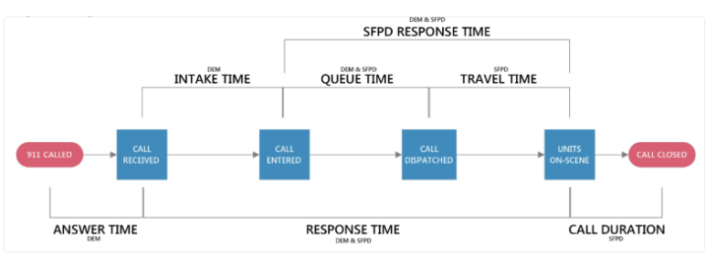

The dataset allows for detailed analysis of response times and other time intervals involved in handling 9-1-1 calls:

- **Intake Time**: Time from when a call is received to when it is entered into the queue (received_datetime to entry_datetime).
- **Queue Time**: Time from when a call is entered into the queue to when it is dispatched (entry_datetime to dispatch_datetime).
- **Travel Time**: Time from when a call is dispatched to when the first unit arrives on the scene (dispatch_datetime to onscene_datetime).
- **Call Duration**: Time from when the first unit arrives on the scene to when the last unit closes the call (onscene_datetime to closed_datetime).

<b>SFPD Response Time</b>: Combines Queue and Travel Time, representing the time from when the call is entered into the queue to when the first unit arrives on the scene.

<b>Response Time</b>: Total time from when the call is received to when the first unit arrives on the scene, reflecting the wait time experienced by the citizen.

This detailed breakdown helps in understanding and improving the efficiency and effectiveness of law enforcement response to incidents.

<a href="https://sfdigitalservices.gitbook.io/dataset-explainers/law-enforcement-dispatched-calls-for-service"> overview of the dataset </a>
## Project Architecture & Components

Below is a diagram illustrating the architecture of the project and its components:

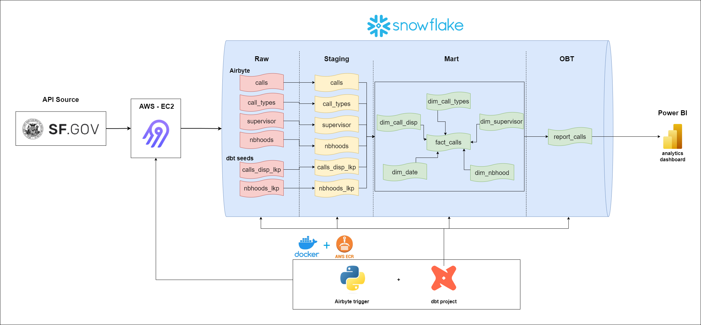

### 1. Source Database: DataSF

The source database is an API containing vast amounts of information about the city of San Francisco. We have chosen this dataset to practice cleaning real life data.

### 2. Destination Data Warehouse: Snowflake (OLAP)

Snowflake is the destination data warehouse where the extracted data from the API will be loaded for analytical processing.

### 3. Data Extraction Tool: Airbyte

Airbyte is the data extraction tool that was used in this project. It is an open-source project and it is responsible for extracting data from our source database and loading it into the 'Raw Schema' within our Data Warehouse (Snowflake).

### 4. Data Transformation Tool: dbt

For our transformations, we utilized DBT (Data Build Tool) to achieve streamlined and modular data transformation. DBT not only facilitates data transformation but also supports testing to ensure the accuracy of our transformations and final tables. The process involves DBT gathering raw data loaded into Snowflake, transforming it, and subsequently loading it into user-defined schemas. 

In our specific case, these schemas include Staging, Marts, and Reports. Thus, our data flow follows this sequence: Raw Schema → DBT → Creation of schemas (Staging, Marts, Reports) and all associated tables within these schemas.

### 5. Orchestrator: `orchestrate.sh` bash file

The orchestrator responsible for running the workflow and calling each step in the correct order is a bash file. While there are more robust and specific tools for orchestrating data pipelines, this project focuses on understanding each step more deeply without having to worry about the orchestration part.

### 6. BI Tool: Power BI

Power BI is the BI tool we chose to create visualizations and analysis of our transformed data. We did it mostly because we are proficient with this tool.

## Project Workflow

1. **Extraction (E)**: Airbyte connects to the API database 

2. **Loading (L)**: Airbyte loads the extracted data into Snowflake using the appropriate Snowflake connector. The data is loaded into a `raw` schema.

3. **Transformation (T)**: Transformation tasks, if necessary, can be performed with downstream processes such as DBT running against Snowflake. These tasks are responsible for creating the `staging`, `marts` schemas.

## Implementation Steps


1. **Deploy Airbyte on AWS EC2 with SSH Tunneling**:
    - Launch an EC2 instance on AWS and connect to it via SSH.
    - Install Docker and Docker Compose on the EC2 instance.
    - Clone the Airbyte repository and start the Docker containers.
    - Access Airbyte securely via SSH tunneling.

2. **Set up Airbyte**:
    - create the custom connector to the DataSF API using the appropriate YML file.
    - The custom connector allows using incremental or full load, ensuring that only incremental data is extracted where it is needed during each extraction cycle.
    - The extracted data is then loaded into Snowflake for further processing and analysis.

3. **Integrate Airbyte into ELT pipeline**:
    - Create a Python code to programmatically control Airbyte through its API. For more reference, go to <https://api.airbyte.com/> to see how the API works.
    - In this project, the `extract_load/pipelines/airbyte_extract_load.py` Python file hosts the code responsible for triggering the API - Snowflake connection sync.
    - In order to run the `extract_load/pipelines/airbyte_extract_load.py` Python file, please provide the following environment variables:
        - `AIRBYTE_USERNAME`
        - `AIRBYTE_PASSWORD`
        - `AIRBYTE_SERVER_NAME`
        - `AIRBYTE_CONNECTION_ID`
        - `SNOWFLAKE_USERNAME`
        - `SNOWFLAKE_PASSWORD`

4. **Transform the Data:**
    - Install dbt and the dbt plugin for Snowflake using the following commands in the terminal (bash):

    ```bash
    pip install dbt-core==1.7.0

    pip install dbt-snowflake==1.7.0
    ```

    - Run `dbt init` in the Command Line Interface (CLI) to initialize DBT and start a new project.
    - Provide the project's name, creating a dedicated folder within the directory where DBT was initialized.
    - The `models` folder within this directory is where transformations are defined.
    - Each folder in the `models` folder represents a schema within the database, with each file within these folders representing a model for a table in the schema.
    - Define the transformations for each model using DBT's Snowflake SQL syntax.

5. **Orchestrate Workflow**:
    - Create a bash file to run the workflow and call each step in the correct order.
    - In this project, the `orchestrate.sh` file is responsible for orchestrating the tasks: first it calls the Airbyte API, installs the dbt packages and then performs the transformations materializing the dbt models.

6. **Schedule ELT pipeline on the cloud**:
    - Package up the code and all the dependencies with Docker. The `Dockerfile` is responsible for assembling the necessary Docker image to run this project.
    - Push the Docker image to AWS ECR.
    - Create a Scheduled task in ECS to run the Docker container by pulling the Docker image from AWS ECR.

## Functionality Screenshots

Here are some screenshots that demonstrate the functionality working inside Airbyte:
building custom api connector:

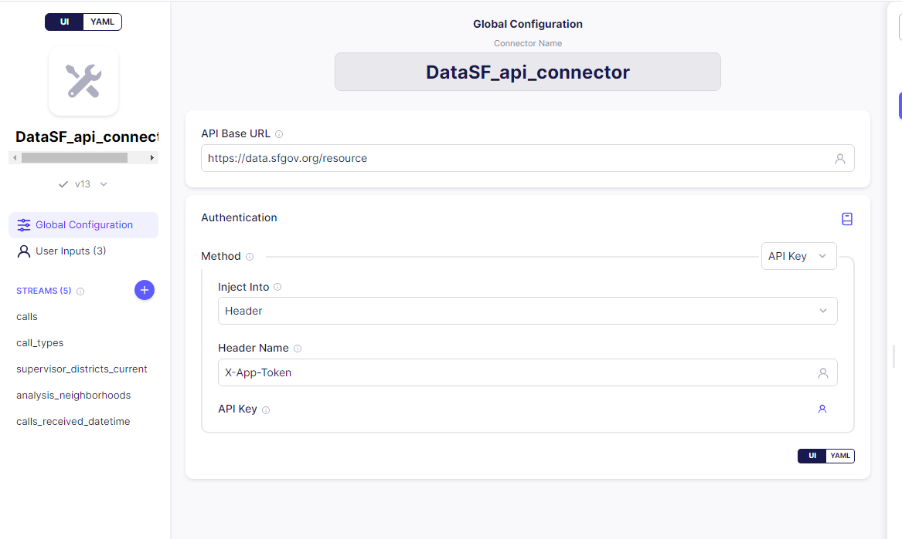

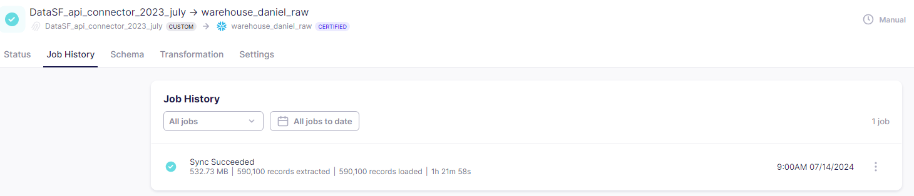

SCD testing:
before insert:
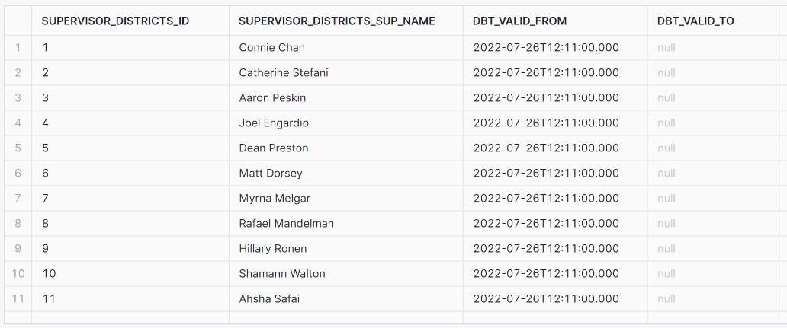
after insert:
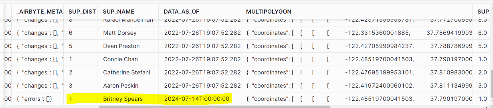
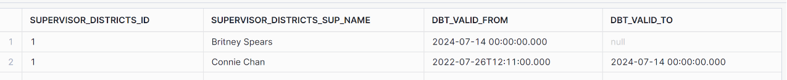


## ERD Diagrams
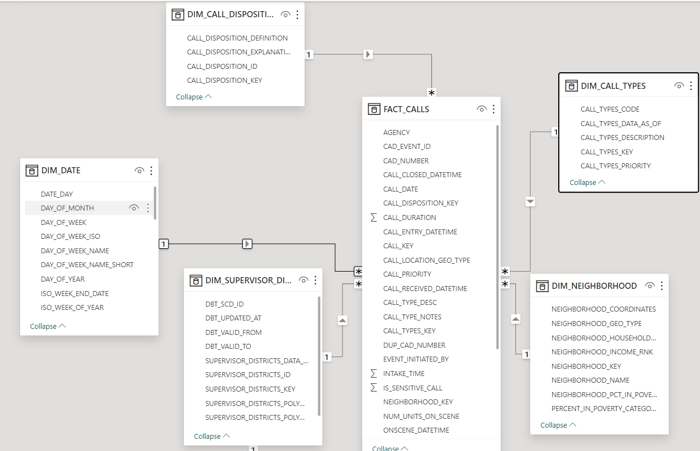

## Conclusion

As stated earlier, our goal was to answer the following questions:

- Which call type is most commonly dispatched?
- How the respond time changes with respect to various attributes such as:
    -  Call type priority
    -  Day of the week
    -  Supervisor districts
    -  Neighborhoods
- Does higher priority call types have a shorter response time?
- Which police district has the slowest response time

We used  to visualize these findings:

<b><u>response time by police districts and neighborhoods:</u></b>
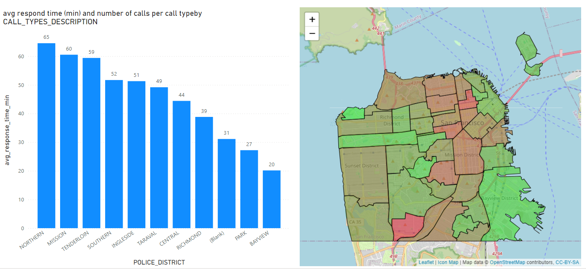

<b><u>response time by call type:</u></b>
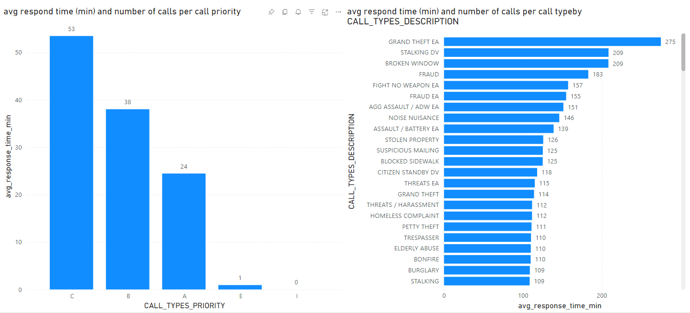

<b><u>call count by month:</u></b>
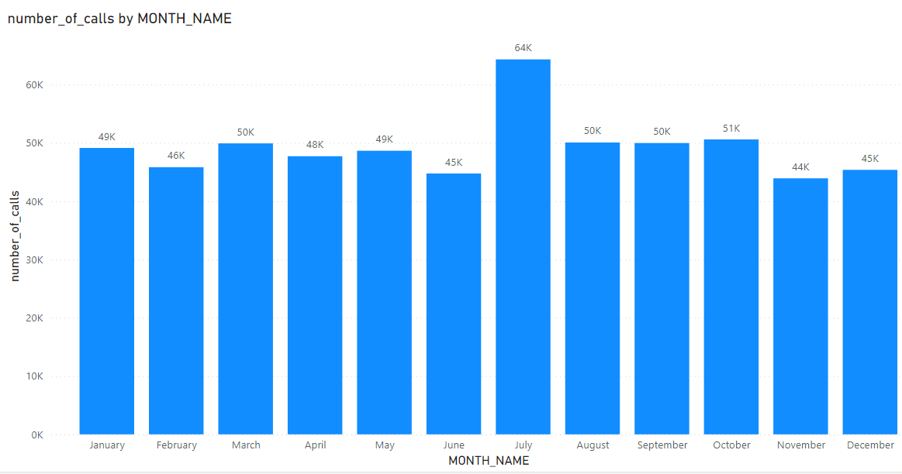

<b><u>responce time by neighborhoods:</u></b>
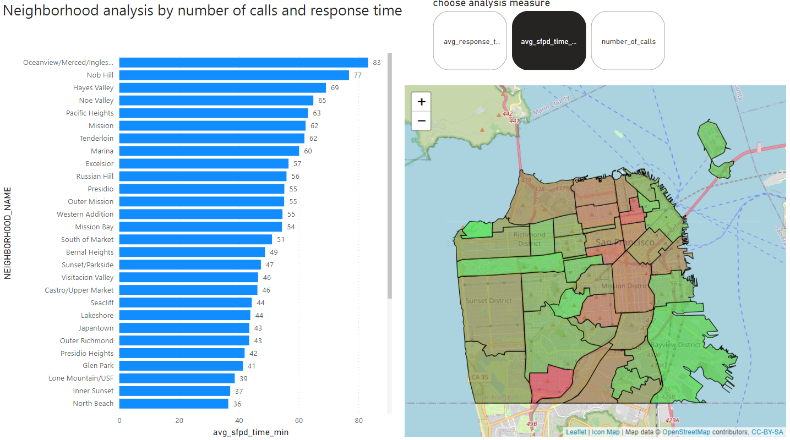

<b><u>call count by day of the week:</u></b>
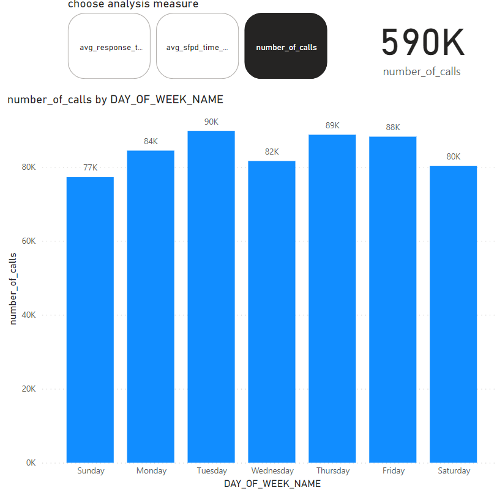

<b><u>Explore the dashboard online:</u></b>

[](https://app.powerbi.com/view?r=eyJrIjoiMjMyOTlhZTYtOTJiYy00MjVjLTg2ZGItYmQ3MWIxZTliOGQ2IiwidCI6IjcxYzViZWNkLWVkMWEtNDBiNy05NjdkLWE1NmQwZDYzY2QyNiIsImMiOjl9)


